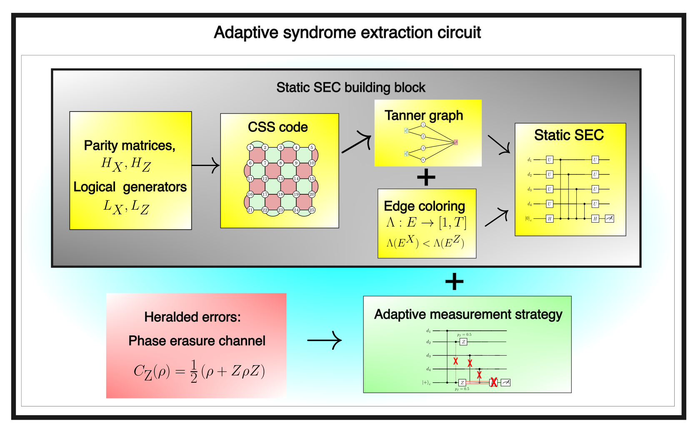

# Adaptive_SEC_heralded_errors

**Adaptive syndrome extraction circuits with heralded CZ gate failures**

  

---

##  Step 1: Parity Check Matrix and Logical Operators

We use `css.py` to define CSS codes. This script imports quantum LDPC codes from the [qLDPC repository](https://github.com/qLDPCOrg/qLDPC).

---

##  Step 2: Tanner Graph and Edge Coloring

The Tanner graph and its  edge-coloring are constructed using:
- `graphs/tanner_graph.py`
- `graphs/edge_coloring.py`

---

##  Step 3: Static Syndrome Extraction Circuits

Custom static syndrome extraction circuits are implemented in:
- `sec_circuits/sec_static.py`

Quatum memory experiments with custom SEC and built-in Stim is shown in `example_css.ipynb`

---

##  Step 4: Adaptive Syndrome Extraction Circuits

We add stochastic heralded CZ gate failures in:
- `failing_gates_randomly.ipynb`

Then, detectors and adapted circuits are constructed for each round of syndrome extraction.

---
